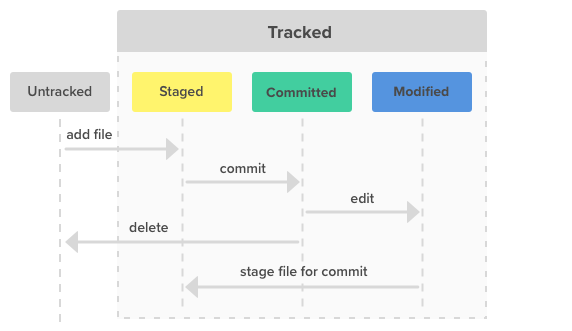

# Commands (Basics) ->
git init

git add .

git commit -m "Init"

git remote add origin https://github.com/A-R-M-028/Form_react.git

git branch -M main

git remote set-url <remote_name> <ssh_remote_url>

git push -f origin main

# Commands (Starting) ->
cd fundamental

 git --version

 git config --global user.name "YourUserName"

git config --global user.email "your.email@example.com"

git config --global user.name

git config --global user.email

 git checkout -b "Testing" // Branch Name

git init

git status

git add . (Add all the files) OR git add <filename>

git commit -m "Hey i'm pracicing"

### Now do some changes.................

git add .

git status

git commit "Modified changed"

git revert //to revert the changes

git log --oneline //to see changes

git reset --hard <number_from_git log --online> //to revert the changes

git remote add origin <link>

git branch -M main

git push -f origin main

 # Commands (Adv) ->

 touch main.py

 git status

 git add main.py

 git add .

 git commit -m "Initial commit"
 
 git merge

 ## Linux/Unix ->
 touch //Create a file

 mkdir // Create a folder

 rm <filename> // Delete a file

 rm -rf <foldername> // Delete a folder

 cat // See the content in a file

 nano/vi main.py // To update the content in a file

 ls // List down all the content of the current directory

 # Git workflow
 

 

